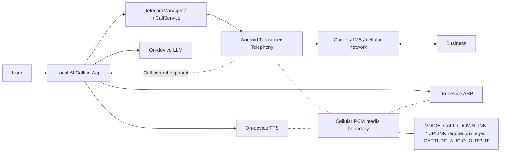
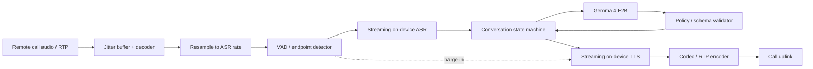

# Building an Entirely On-Device Android AI Phone-Calling Agent

## Executive summary

**The AI portion of this product is now technically practical on a high-end Android phone. The ordinary cellular-telephone portion is the blocker.**

As of September 2026, Google explicitly supports **Gemma 4 E2B and E4B on Android through LiteRT-LM**. Gemma 4 E2B is packaged at about **2.58 GB** and, in Google's Samsung Galaxy S26 Ultra benchmark, reaches roughly **47 tokens/s on CPU or 52 tokens/s on GPU**, with GPU time-to-first-token around **0.3 seconds**. Gemma 4 E4B is about **3.65 GB**, with roughly **18 tokens/s CPU / 22 tokens/s GPU** and **0.8-second GPU time-to-first-token** on the same device. LiteRT-LM supports Android CPU, GPU, and NPU execution and has a stable Kotlin API. Gemma 4 is licensed under **Apache 2.0**, making it particularly attractive for a commercial app. citeturn19view1turn19view2turn25search26

An Android app can also legitimately become the **default dialer**, place normal SIM/carrier calls through `TelecomManager`, display and control incoming/outgoing calls through `InCallService`, monitor call state, and optionally provide call screening. `TelecomManager.placeCall()` is a public API, while the default-dialer role is exposed through `RoleManager.ROLE_DIALER`. citeturn10view0turn10view1turn15search0

The critical problem is **call media access**. Android's documented `VOICE_CALL`, `VOICE_DOWNLINK`, and `VOICE_UPLINK` audio sources all require `CAPTURE_AUDIO_OUTPUT`, and Android explicitly says that permission is **reserved for system components and unavailable to third-party applications**. Becoming the default dialer does not change that permission boundary. citeturn10view2turn10view3

There is likewise no public Android Telecom API that gives an ordinary app a writable PCM stream representing the cellular call's microphone uplink. `InCallService`, `TelecomManager`, `ConnectionService`, call routing, and call screening control calls, but they do not constitute a general-purpose bidirectional media interface into a carrier SIM call. That conclusion is an inference from the documented Telecom and media APIs, reinforced by the explicit restriction on cellular call-audio capture. citeturn10view0turn10view1turn10view2

**Therefore the exact requested combination is not realistically implementable as a normal Google Play Android application:**

| Requirement | Ordinary third-party Android app |
|---|---|
| Run LLM entirely on phone | **Yes** |
| Run ASR/VAD/TTS entirely on phone | **Yes** |
| Place a SIM/carrier phone call | **Yes** |
| Receive/manage normal cellular calls as default dialer | **Yes** |
| Read the business's cellular-call audio as PCM | **No supported public API** |
| Inject generated TTS directly into cellular-call uplink | **No supported public API** |
| Fully autonomous cellular conversation | **No, because of those two media restrictions** |
| Fully autonomous SIP/VoIP conversation with local AI | **Yes, practical** |
| Fully autonomous carrier call with OEM/system privileges | **Potentially yes, but requires device/OEM/carrier integration** |

The recommended product strategy is therefore to build **one local AI engine with interchangeable telephony transports**:

1. **Production path:** use SIP/VoIP for autonomous calls, while keeping ASR, transcript, reasoning, and TTS local.
2. **Cellular-control path:** support ordinary SIM calls for dialing, incoming-call UI, call state, and human handoff, but explicitly mark autonomous cellular audio as unsupported.
3. **Strategic path:** pursue an OEM/carrier partnership if use of the subscriber's actual SIM voice service is non-negotiable.
4. **Do not build the product around speakerphone acoustic feedback, accessibility hacks, rooting, or undocumented audio-routing behavior.** Those approaches are device-specific and do not create a supported third-party cellular media channel. The Android permission model is deliberately restrictive here. citeturn10view2turn10view3

One privacy clarification is important. A telephone call necessarily sends speech off the handset **to the called business through the carrier or VoIP network**. What is achievable is: **no copy of the audio, transcript, user question, model prompt, or AI output is sent to an AI/cloud-processing service**. A literal requirement that *no audio at all* leave the phone is incompatible with making a phone call.

My recommended MVP is consequently:

> **Android app + Gemma 4 E2B + local streaming ASR + local TTS + deterministic dialogue controller + SIP/PSTN gateway, with no cloud AI and no off-device transcript storage.**

That is technically achievable today. The version using the user's ordinary SIM/carrier audio path requires privileged OEM/platform access that an ordinary Play Store app does not receive. citeturn19view1turn19view2turn10view2


## Feasibility of cellular calling and the Android telephony boundary

Android's telephony stack divides **call control** from **call media**. This distinction determines the whole project.

`TelecomManager.placeCall(Uri, Bundle)` can initiate calls, including through a managed `ConnectionService`, when the app has the appropriate permissions. Android's own example uses a `tel:` URI and `TelecomManager.placeCall()`. citeturn10view0

A replacement/default phone application uses `InCallService`. Android documents that a default dialer must handle `ACTION_DIAL`, provide an `InCallService`, and implement incoming and ongoing-call UI; the user grants this position through the dialer role. Emergency calls remain handled through the preloaded system dialer even when another app holds the normal default-dialer role. citeturn10view1

`CallScreeningService` is a different facility. It allows a qualifying service to evaluate incoming calls before the user sees them and can also observe outgoing calls for caller-ID purposes. It is useful for spam handling or deciding whether a callback from a business should be surfaced, but it is **not an audio-stream API**. citeturn15search0

`TelephonyManager` can provide call state; the older aggregate `getCallState()` was deprecated in API 31 in favor of mechanisms such as `TelephonyCallback.CallStateListener`, subscription-specific state, or `TelecomManager.isInCall()`. For applications targeting API 31+, the older method requires `READ_PHONE_STATE`. citeturn18view2turn18view3

The important limitation occurs lower in the media stack. Android defines:

- `VOICE_CALL`: uplink + downlink.
- `VOICE_DOWNLINK`: audio received from the remote party.
- `VOICE_UPLINK`: audio being sent toward the remote party.

All of those sources require `CAPTURE_AUDIO_OUTPUT`; Android explicitly documents that this permission is reserved for system components and unavailable to third-party apps. citeturn10view2turn10view3

That means code conceptually like this is **not a deployable solution** for an ordinary application:

```kotlin
// Do NOT design the production app around this.
// VOICE_CALL requires CAPTURE_AUDIO_OUTPUT,
// which ordinary third-party apps cannot obtain.
val recorder = AudioRecord(
    MediaRecorder.AudioSource.VOICE_CALL,
    16_000,
    AudioFormat.CHANNEL_IN_MONO,
    AudioFormat.ENCODING_PCM_16BIT,
    bufferSize
)
```

Making the app the default dialer does **not** confer `CAPTURE_AUDIO_OUTPUT`. Default-dialer functionality and system-level output capture are different permissions/capabilities. citeturn10view1turn10view3

The outgoing side has a symmetrical architectural problem. Android exposes controls such as dialing, disconnecting, holding, choosing endpoints, DTMF, and call UI, but it does not expose a third-party API equivalent to:

```text
writePcmIntoCellularMicrophoneUplink(bytes)
```

So although local TTS can create a PCM stream, there is nowhere supported for a normal application to inject that stream **directly into a SIM voice call**. This is an inference from the public Telecom/audio API surface rather than a single Android sentence saying “TTS injection is forbidden.” The same platform design that keeps cellular downlink audio away from third-party apps also prevents building a general bidirectional software audio bridge around ordinary carrier calls. citeturn10view0turn10view1turn10view2



**`ConnectionService` does not solve this for SIM calls.** It is extremely useful when the application owns the call technology itself—for example, an app implementing SIP or another VoIP service. A self-managed communications application can register its own call with Telecom and use `MANAGE_OWN_CALLS`; Android's foreground-service rules explicitly recognize this model. But that makes the app the owner of the VoIP connection; it does not turn the app into the media owner of the carrier's Telephony connection. citeturn18view0

This distinction leads to two architectures:

| Architecture | Who owns call media? | Autonomous AI feasible? | Uses user's SIM voice service? |
|---|---:|---:|---:|
| Default dialer over normal carrier call | Android Telephony/carrier stack | **No**, ordinary app lacks bidirectional PCM | **Yes** |
| Self-managed SIP/VoIP `ConnectionService` | Your app | **Yes** | No |
| SIP-to-PSTN gateway | Your app until SIP provider; provider bridges PSTN | **Yes** | No; uses IP data |
| OEM/carrier privileged app | OEM/system telephony integration | Potentially **yes** | **Yes** |
| Root/custom ROM | Custom system | Technically possible | Potentially | Not a consumer Play solution |

**VoLTE, IMS, and CSFB do not remove this limitation.** AOSP describes `ImsService` as the interface between Android and a **vendor- or carrier-provided IMS implementation**, with implementation potentially partly or fully offloaded to the modem; it is a System API rather than an ordinary app-level media bridge. Consequently the application should regard whether the carrier uses IMS/VoLTE, another radio bearer, or a legacy fallback as an implementation detail of the system telephony stack. citeturn25search1turn25search5

For your design, do **not** make AI behavior conditional on “forcing VoLTE.” The app should select the appropriate `PhoneAccountHandle`/SIM where needed and let Android/carrier telephony establish the call. It has neither a portable need nor a normal public mechanism to take ownership of the carrier IMS media session. citeturn25search1

A speakerphone workaround deserves explicit rejection. Conceptually, one could try to play TTS through the loudspeaker and let the handset microphone acoustically feed it back into the carrier call, while using another microphone capture to hear the business. Even on devices where some part of this seems to work, this is an **acoustic workaround rather than supported uplink injection**. It introduces echo, double talk, feedback, OEM-dependent concurrent-capture behavior, privacy problems, and very poor deterministic testing. It is reasonable for a one-day lab experiment but not as the foundation of a production product.

The feasibility gate for the project should therefore be:

> **Do not spend months optimizing the LLM before accepting that ordinary Android cellular-call PCM is not available. Build a one-week capability spike first, record that limitation as a hard platform requirement, and select SIP/VoIP or OEM partnership before the autonomous-call milestone.**


## On-device AI models, runtime, and real-time audio design

The on-device AI side is considerably more encouraging.

Google's current LiteRT-LM documentation describes it as the production-oriented orchestration layer for local LLM inference, with Android CPU, GPU, and NPU support and stable Kotlin APIs. It includes support for Gemma, Llama, Phi, Qwen and other model families. citeturn19view2turn25search6turn25search26

Gemma 4 is particularly well matched to this product. Google says E2B and E4B are intended for mobile/edge use, both are supported in LiteRT-LM now, and Gemma 4 uses Apache 2.0 licensing. Google also reports Multi-Token Prediction acceleration of up to 2.2× for decode on mobile GPUs in its documented scenarios. citeturn19view1

**Recommended model comparison**

| Model | Mobile footprint / size | Mobile performance evidence | License | Android runtime position | Recommendation |
|---|---:|---|---|---|---|
| **Gemma 4 E2B** | **2.58 GB LiteRT-LM package** | S26 Ultra: 47 tok/s CPU, 52 GPU; TTFT 1.8 s CPU, 0.3 s GPU | **Apache 2.0** | Native LiteRT-LM Android support | **Best primary choice**. Fast enough for telephone dialogue and easiest current Google integration. citeturn19view1turn19view2 |
| **Gemma 4 E4B** | **3.65 GB** | S26 Ultra: 18 tok/s CPU, 22 GPU; TTFT 5.3 s CPU, 0.8 s GPU | **Apache 2.0** | Native LiteRT-LM | Better model capacity, but substantially more demanding. Use on ≥12 GB devices after benchmarks. citeturn19view1 |
| **Gemma 3 1B** | About **1.0 GB** in Google's LiteRT table | S24 Ultra: 33 tok/s CPU, 24 GPU in Google's listed configuration | Gemma terms apply to that generation | LiteRT-LM / LLM Inference | Good low-memory fallback where Gemma 4 E2B is too large. citeturn19view2turn19view3 |
| **Llama 3.2 1B / 3B** | 1B / 3B parameters; a theoretical 4-bit weight-only footprint is roughly 0.5 / 1.5 GB before metadata/KV/runtime overhead | Must benchmark on your selected runtime/device | Meta Llama Community License rather than Apache/MIT; legal review recommended | ExecuTorch is a natural PyTorch route; LiteRT-LM also supports the Llama family | Strong alternative, particularly 3B, but Gemma 4 currently offers a cleaner officially benchmarked Android path. Meta documents lightweight 1B and 3B Llama 3.2 variants and quantized releases. citeturn20search1turn14search10 |
| **Ministral 3B** | 3B parameters; theoretical 4-bit weights ≈1.5 GB before overhead | Designed by Mistral as an edge model | Mistral's original Ministral 3B self-deployment offering uses a **commercial license**, creating more product-license friction | Requires a compatible conversion/runtime path | Technically interesting, but not my first choice for this app because of licensing and integration friction. citeturn21search4 |
| **Qwen 2.5 1.5B** | Google's LiteRT table lists ~**1.6 GB** | Google lists 34 tok/s CPU / 31 GPU decode on S25 Ultra | Verify the exact upstream model license/version before shipping | LiteRT-LM supported | Good lightweight benchmark candidate. citeturn19view2 |

The Gemma 4 benchmark is especially useful because this use case does not require enormous generation throughput. A phone agent generally produces short utterances. What matters more is **time to first useful spoken response**, which combines endpoint detection, ASR finalization, LLM prefill/first token, TTS startup, and audio transport. Google's 0.3-second GPU TTFT for E2B on the S26 Ultra leaves enough room for a conversational pipeline if the other stages are also optimized. citeturn19view1

I would establish these **engineering targets**, rather than treating them as universal model claims:

| Metric | Flagship target | Minimum acceptable |
|---|---:|---:|
| VAD end-of-turn detection | 250–400 ms | 500 ms |
| ASR finalization after endpoint | <200 ms | 400 ms |
| LLM first token | <700 ms | 1.2 s |
| Sustained LLM decode | >20 tok/s | 10–15 tok/s |
| TTS first playable chunk | <200 ms | 350 ms |
| End of business speech → first bot audio | **<1.2 s P50** | **<1.8 s P95** |
| Barge-in stop time | <150 ms | 250 ms |

Those numbers are product acceptance targets, not promises about every Android device.

For memory, I would set a more conservative device policy than simply looking at model-file size. The phone must simultaneously hold the model runtime, KV cache, ASR, TTS, dialogue state, audio buffers, UI, and the rest of Android. Based on the official Gemma package sizes and benchmark memory figures, I would plan for:

- **Gemma 4 E2B:** 8 GB device RAM as the engineering minimum, **12 GB preferred**.
- **Gemma 4 E4B:** 12 GB minimum, **16 GB preferred**.
- **6 GB phones:** use the 1B fallback or declare autonomous AI unsupported.

These are conservative product-planning recommendations, not Google's published minimum requirements. Google's actual benchmark figures show that model-specific runtime memory varies substantially between CPU/GPU paths, so your release gate should be empirical rather than based only on nominal RAM. citeturn19view1turn19view2

Plan for approximately **4–6 GB of local storage** for an E2B configuration after adding ASR, TTS, tokenizers, models, and temporary space, and approximately **6–8 GB** for a richer E4B installation. Those totals are engineering budgets; the only externally published component size in that estimate is the Gemma model itself. citeturn19view1

**Runtime selection**

| Runtime | Role in this project | Assessment |
|---|---|---|
| **LiteRT-LM** | Main Gemma 4 LLM | **Preferred.** Stable Kotlin API, CPU/GPU/NPU, Gemma 4 packages, tool use/constrained decoding. citeturn19view2turn25search26 |
| **LiteRT / TFLite** | Small VAD, wake-word, auxiliary ML | Excellent fit. Google also supports PyTorch-to-LiteRT conversion and packaging into `.litertlm`/task bundles. citeturn19view3 |
| **ONNX Runtime Mobile** | Streaming ASR/TTS or alternative local models | Good choice. ONNX Runtime Mobile explicitly supports Android and iOS and provides mobile execution-provider infrastructure. citeturn23view1 |
| **ExecuTorch** | Models originating in modern PyTorch | Good secondary choice for PyTorch-native deployment; designed for edge/mobile execution and hardware acceleration. citeturn14search10turn14search1 |
| **PyTorch Mobile** | Legacy approach | Do not select for a new architecture; use ExecuTorch for a modern PyTorch path. citeturn14search10 |
| **NNAPI directly** | Device acceleration | Do not build a new backend strategy around it; Google's current migration guidance deprecates NNAPI in favor of newer LiteRT/delegate paths. citeturn3search2 |
| **Core ML** | Apple platforms | Not an Android runtime; only relevant if you later produce an iOS version. citeturn13search2 |

The audio system should **not** make the LLM directly responsible for every millisecond of conversation. Use a deterministic real-time pipeline around it:



For a SIP implementation, retain separate decoded inbound and encoded outbound PCM streams. Use roughly 10–20 ms audio frames internally, apply VAD continuously, and treat the first release as **controlled half-duplex with barge-in** rather than attempting unrestricted simultaneous conversation. The model stops speaking when confident remote speech appears, waits for the remote endpoint, transcribes the completed utterance, and generates the next response.

Android also has an `AcousticEchoCanceler` that attaches to an `AudioRecord` session and is specifically documented for voice-chat, video-conferencing, and SIP-style communication applications. Availability is device-dependent and can be checked with `AcousticEchoCanceler.isAvailable()`. citeturn24view2turn24view3

AEC is most important if the human user can take over through the device microphone/speaker. A pure bot-controlled SIP pipeline does not need to acoustically play TTS into its own microphone: it can write synthesized PCM directly to the VoIP encoder. That is another major reason SIP is technically superior to the carrier-speakerphone workaround.

For ASR, Android provides `SpeechRecognizer.createOnDeviceSpeechRecognizer()` beginning at API 31, together with `isOnDeviceRecognitionAvailable()`. However, support is device-dependent, so it is useful as a prototype or optional fallback but not sufficient for a product whose privacy contract promises a guaranteed bundled offline recognizer on every supported handset. citeturn24view0turn24view1

The production ASR layer should therefore be behind a PCM-oriented interface such as:

```kotlin
interface StreamingAsr {
    suspend fun start(sampleRateHz: Int = 16_000)
    suspend fun acceptPcm16(samples: ShortArray)
    val partials: kotlinx.coroutines.flow.Flow<String>
    val finals: kotlinx.coroutines.flow.Flow<AsrResult>
    suspend fun stop()
}

data class AsrResult(
    val text: String,
    val confidence: Float?,
    val endpointTimestampMs: Long
)
```

Evaluate a streaming ONNX transducer/Conformer implementation, `sherpa-onnx`, and a Whisper-family implementation on the actual device matrix before locking the ASR implementation. For this application, **streaming latency and telephone-speech accuracy matter more than benchmark accuracy on long recordings**.

TTS should also accept text incrementally:

```kotlin
interface LocalTts {
    /**
     * Starts yielding audio before the complete utterance has been synthesized.
     */
    fun synthesizeStreaming(
        text: String,
        voice: VoiceId
    ): kotlinx.coroutines.flow.Flow<PcmFrame>

    suspend fun cancel()
}
```

Do not wait for a paragraph-long LLM completion. Generate one concise clause, validate it, begin TTS, and continue streaming only when safe.

The LLM itself should return **structured decisions**, not arbitrary free-form agent actions:

```kotlin
@Serializable
data class AgentDecision(
    val action: Action,
    val speech: String? = null,
    val extractedAnswer: String? = null,
    val confidence: Float = 0f,
    val reasonCode: String
)

@Serializable
enum class Action {
    SPEAK,
    LISTEN,
    ASK_CLARIFICATION,
    SEND_DTMF,
    HANDOFF_TO_USER,
    FINISH,
    ABORT
}
```

LiteRT-LM currently advertises tool use and constrained decoding, which fits this architecture well. citeturn19view2

The outer controller should enforce:

```text
PRE_CALL_CONFIRMATION
        ↓
DIALING
        ↓
CONNECTED
        ↓
BOT_DISCLOSURE
        ↓
ASK_PRIMARY_QUESTION
        ↓
LISTEN
   ↙          ↘
CLARIFY      ANSWER_FOUND
   ↓             ↓
LISTEN        CONFIRM_IF_NEEDED
                  ↓
               GOODBYE
                  ↓
               COMPLETE
```

This is much safer and more predictable than telling a 2B model, “Call this business and figure it out.”


## Android architecture, APIs, permissions, and implementation blueprint

For a new application in September 2026, I would develop against **Android 17 / API 37** while maintaining a deliberate compatibility floor. Android 17 is the current Android platform generation documented by Google. citeturn15search14

My recommended defaults are:

| Setting | Recommendation | Reason |
|---|---|---|
| `compileSdk` | **37** | Current Android 17 APIs. citeturn15search14 |
| `targetSdk` | **37** for a greenfield 2026 build | Start with current behavior rather than accumulating compatibility debt. citeturn15search14 |
| `minSdk` | **31** initially | Simplifies modern telephony/audio behavior and enables the API-31 on-device SpeechRecognizer fallback. citeturn24view0 |
| ABI | `arm64-v8a` initially | Keeps the supported hardware set focused on phones capable of practical LLM inference. |
| LLM | Gemma 4 E2B | Best overall mobile fit from current official benchmark/support. citeturn19view1 |
| Main LLM runtime | LiteRT-LM | Official current Gemma 4 path. citeturn19view2turn25search26 |
| Speech runtime | ONNX/LiteRT native model | Gives the application direct PCM control and deterministic offline behavior. citeturn23view1 |
| UI | Kotlin + Jetpack Compose | Straightforward modern Android architecture. |
| Concurrency | Kotlin coroutines / Flow | Natural fit for streaming ASR/LLM/TTS pipelines. |

A lower `minSdk`, such as 29, is entirely possible if ASR is always bundled, but API 31 provides a cleaner first product boundary.

I would create these modules:

```text
:app
:core-model
:core-privacy
:telephony-api
:telephony-pstn
:telephony-sip
:audio-core
:asr-local
:tts-local
:llm-litert
:agent-orchestrator
:benchmark
:test-fixtures
```

And this central abstraction:

```kotlin
interface CallTransport {
    val state: StateFlow<CallState>

    suspend fun dial(destination: String)
    suspend fun answer()
    suspend fun hangUp()
    suspend fun sendDtmf(digit: Char)

    /**
     * Only true for transports where the app legally and technically
     * owns the media path, e.g. SIP/VoIP.
     */
    val supportsProgrammaticMedia: Boolean

    val remoteAudio: Flow<PcmFrame>

    suspend fun sendAudio(frame: PcmFrame)
}
```

The PSTN implementation must deliberately report:

```kotlin
override val supportsProgrammaticMedia: Boolean = false

override val remoteAudio: Flow<PcmFrame>
    get() = flow {
        throw UnsupportedOperationException(
            "Public Android APIs do not expose cellular call PCM to third-party apps"
        )
    }

override suspend fun sendAudio(frame: PcmFrame) {
    throw UnsupportedOperationException(
        "Public Android APIs do not expose cellular uplink PCM injection"
    )
}
```

This is a feature, not a failure. It prevents future developers from quietly adding an unsupported audio hack.

The SIP implementation supplies both methods and therefore unlocks the autonomous agent.

For ordinary outbound carrier calls:

```kotlin
@SuppressLint("MissingPermission")
fun placeCarrierCall(
    context: Context,
    e164Number: String
) {
    val telecom = context.getSystemService(TelecomManager::class.java)
    val uri = Uri.fromParts("tel", e164Number, null)

    val extras = Bundle().apply {
        putBoolean(
            TelecomManager.EXTRA_START_CALL_WITH_SPEAKERPHONE,
            false
        )
    }

    telecom.placeCall(uri, extras)
}
```

`TelecomManager.placeCall()` and the associated `CALL_PHONE` behavior are documented public APIs. citeturn10view0

To request the default-dialer role:

```kotlin
fun buildDialerRoleRequest(context: Context): Intent? {
    val roles = context.getSystemService(RoleManager::class.java)

    if (!roles.isRoleAvailable(RoleManager.ROLE_DIALER)) {
        return null
    }

    if (roles.isRoleHeld(RoleManager.ROLE_DIALER)) {
        return null
    }

    return roles.createRequestRoleIntent(RoleManager.ROLE_DIALER)
}
```

The default dialer must also satisfy Android's requirements for `ACTION_DIAL` and `InCallService`. citeturn10view1

A suitable base manifest is:

```xml
<manifest xmlns:android="http://schemas.android.com/apk/res/android">

    <!-- Carrier call initiation -->
    <uses-permission android:name="android.permission.CALL_PHONE" />

    <!-- Include only if TelephonyCallback/device call-state APIs need it. -->
    <uses-permission android:name="android.permission.READ_PHONE_STATE" />

    <!-- User voice input / app-owned VoIP media. -->
    <uses-permission android:name="android.permission.RECORD_AUDIO" />

    <uses-permission android:name="android.permission.FOREGROUND_SERVICE" />
    <uses-permission
        android:name="android.permission.FOREGROUND_SERVICE_MICROPHONE" />
    <uses-permission
        android:name="android.permission.FOREGROUND_SERVICE_PHONE_CALL" />

    <uses-permission android:name="android.permission.POST_NOTIFICATIONS" />

    <!-- DO NOT request CAPTURE_AUDIO_OUTPUT.
         It is not available to ordinary third-party apps. -->

    <uses-feature
        android:name="android.hardware.telephony.calling"
        android:required="true" />

    <application
        android:allowBackup="false"
        android:usesCleartextTraffic="false">

        <activity
            android:name=".ui.DialerActivity"
            android:exported="true">
            <intent-filter>
                <action android:name="android.intent.action.DIAL" />
                <category android:name="android.intent.category.DEFAULT" />
                <data android:scheme="tel" />
            </intent-filter>
        </activity>

        <service
            android:name=".telephony.LocalInCallService"
            android:permission="android.permission.BIND_INCALL_SERVICE"
            android:exported="true">

            <meta-data
                android:name="android.telecom.IN_CALL_SERVICE_UI"
                android:value="true" />

            <meta-data
                android:name="android.telecom.IN_CALL_SERVICE_RINGING"
                android:value="true" />

            <intent-filter>
                <action android:name="android.telecom.InCallService" />
            </intent-filter>
        </service>

        <service
            android:name=".telephony.LocalCallScreeningService"
            android:permission="android.permission.BIND_SCREENING_SERVICE"
            android:exported="true">

            <intent-filter>
                <action android:name="android.telecom.CallScreeningService" />
            </intent-filter>
        </service>

        <service
            android:name=".service.AgentForegroundService"
            android:foregroundServiceType="microphone|phoneCall"
            android:exported="false" />

    </application>
</manifest>
```

Android's documented `InCallService` manifest pattern uses `BIND_INCALL_SERVICE`, while `CallScreeningService` uses `BIND_SCREENING_SERVICE`. citeturn10view1turn15search0

Android's current foreground-service rules require the `microphone` type and `FOREGROUND_SERVICE_MICROPHONE` when continuing microphone capture, and `RECORD_AUDIO` remains a while-in-use permission. `phoneCall` foreground services require `FOREGROUND_SERVICE_PHONE_CALL` and either `MANAGE_OWN_CALLS` or default-dialer status. citeturn18view0turn18view1

The SIP product flavor adds:

```xml
<uses-permission android:name="android.permission.INTERNET" />
<uses-permission android:name="android.permission.MANAGE_OWN_CALLS" />
```

and can register its own `ConnectionService`:

```xml
<service
    android:name=".telephony.sip.AgentConnectionService"
    android:permission="android.permission.BIND_TELECOM_CONNECTION_SERVICE"
    android:exported="true">

    <intent-filter>
        <action android:name="android.telecom.ConnectionService" />
    </intent-filter>
</service>
```

For maximum privacy assurance, create separate build flavors:

```text
pstnControl
    INTERNET permission: absent
    Carrier dialing: yes
    On-device AI: yes
    Autonomous call media: unsupported
    Human handoff: yes

sipAgent
    INTERNET permission: present
    SIP/RTP destination traffic: yes
    Cloud AI traffic: none
    On-device AI: yes
    Autonomous calling: yes
```

That distinction gives you an unusually strong privacy property: the `pstnControl` APK literally lacks `INTERNET`.

A minimal Gradle structure would look like:

```kotlin
plugins {
    id("com.android.application")
    id("org.jetbrains.kotlin.android")
    id("org.jetbrains.kotlin.plugin.serialization")
}

android {
    namespace = "com.example.localcallagent"
    compileSdk = 37

    defaultConfig {
        applicationId = "com.example.localcallagent"
        minSdk = 31
        targetSdk = 37

        ndk {
            abiFilters += "arm64-v8a"
        }
    }

    flavorDimensions += "transport"

    productFlavors {
        create("pstnControl") {
            dimension = "transport"
            applicationIdSuffix = ".pstn"
        }

        create("sipAgent") {
            dimension = "transport"
            applicationIdSuffix = ".sip"
        }
    }

    buildFeatures {
        compose = true
        buildConfig = true
    }
}

dependencies {
    implementation(libs.androidx.core.ktx)
    implementation(libs.androidx.activity.compose)
    implementation(libs.androidx.lifecycle.runtime.ktx)
    implementation(libs.kotlinx.coroutines.android)
    implementation(libs.kotlinx.serialization.json)

    // Resolve and PIN the current LiteRT-LM Android artifact
    // from Google's official Kotlin guide.
    implementation(libs.litert.lm)

    // Candidate runtime for bundled streaming ASR/TTS.
    implementation(libs.onnxruntime.android)
}
```

Google's September 2026 LiteRT-LM Android documentation identifies the Kotlin API as the native Android/JVM API with GPU/NPU acceleration. Because the library is evolving quickly, the implementation agent should resolve the current official Maven coordinate/version from that guide and then **pin it in the version catalog rather than use a floating version**. citeturn25search26turn25search22

A model-provisioning step can use Google's documented Gemma 4 artifact during development:

```bash
python3 -m venv .venv
source .venv/bin/activate

uv tool install litert-lm

litert-lm run \
  --from-huggingface-repo=litert-community/gemma-4-E2B-it-litert-lm \
  gemma-4-E2B-it.litertlm \
  --prompt="Return JSON saying hello."
```

That repository/package flow is documented in Google's Gemma 4 LiteRT-LM instructions. citeturn19view1

For production, compute and pin a model SHA-256 hash and store the expected value in signed app metadata:

```kotlin
data class ModelManifest(
    val id: String,
    val version: String,
    val sha256: String,
    val minimumRamMb: Int,
    val preferredBackend: Backend
)
```

The app should refuse to load a model with the wrong hash.

The app also needs a **capability probe** at startup:

```kotlin
data class DeviceCapabilities(
    val hasTelephonyCalling: Boolean,
    val isDialerRoleAvailable: Boolean,
    val isDialerRoleHeld: Boolean,
    val onDeviceSpeechRecognizerAvailable: Boolean,
    val aecAvailable: Boolean,
    val totalRamMb: Long,
    val modelLoadSucceeded: Boolean,
    val programmaticPstnMediaSupported: Boolean = false
)
```

Do not let the UI advertise “AI will call and talk over your cellular plan” on an ordinary device. Instead display:

```text
Cellular calls
✓ Dial and manage calls
✓ Human takeover
✗ Autonomous call audio unavailable on standard Android

Private AI calls
✓ Autonomous conversation
✓ Local transcription
✓ Local language model
✓ Local speech synthesis
Requires SIP/VoIP calling
```

Google Play permissions deserve deliberate treatment. Google restricts SMS and Call Log permissions and normally expects an app requesting Call Log access to be the default phone/assistant handler or qualify for a specific exception. The policy also lists call-recording uses among disallowed reasons to obtain Call Log permission. Therefore **do not request `READ_CALL_LOG` merely because this is a calling application**. Request it only if a real dialer feature requires it and Play policy eligibility has been established. citeturn17view0


## Privacy, legal, security, and user experience

The privacy promise should be written very precisely:

> **“Speech recognition, transcript processing, AI reasoning, and speech generation run on your device. We do not send your call transcript or a copy of your call audio to an AI server.”**

Do not say, “Your audio never leaves your phone,” because during an actual call the generated speech necessarily travels to the remote party through a carrier, SIP server, or PSTN gateway.

For the strict local-AI architecture, prohibit analytics and crash reporting from receiving:

```text
raw audio
ASR text
user questions
business responses
LLM prompts
LLM completions
telephone numbers
contact names
```

Release builds should not emit conversational content into `Logcat`.

By default, hold the transcript only in memory during the call. At call completion, retain only a structured result such as:

```json
{
  "business": "Example Auto Shop",
  "question": "Do you install customer-supplied brake pads?",
  "answer": "Yes, but there is no warranty on customer-supplied parts.",
  "confidence": 0.91,
  "callDurationSeconds": 83
}
```

A full transcript can be an explicit opt-in feature with local encryption and a visible delete control. Raw audio should not be permanently recorded in the default configuration.

The security model should have several independent layers:

**Network isolation.** The strict PSTN flavor should have no `INTERNET` manifest permission. The SIP flavor necessarily requires networking for its actual call media but should implement an allow-listed communications layer and include no cloud AI SDK.

**Model integrity.** Hash and version every model. Refuse unknown models unless a developer-mode override is explicitly enabled.

**Data-at-rest protection.** Keep user identity, call objectives, and retained transcripts in app-private storage with encryption keys protected through Android Keystore.

**Least privilege.** Do not request Contacts, Call Log, SMS, location, or accessibility permissions unless a concrete shipping feature needs them. Google Play specifically restricts SMS and Call Log access. citeturn17view0

**No accessibility workaround.** `AccessibilityService` should never be used to press another dialer's controls simply to evade Telecom limitations. It still would not provide the protected PCM path and would create severe policy and trust problems.

**No privileged-permission probing.** Do not ship `CAPTURE_AUDIO_OUTPUT` and hope an OEM grants it. Android explicitly labels the permission unavailable to ordinary third-party applications. An OEM build should instead be a separately signed privileged/system product with a documented vendor interface. citeturn10view3

There are also significant legal issues around an autonomous TTS caller.

The FCC has formally confirmed that AI-generated voices fall within the TCPA's category of **artificial or prerecorded voices**. That does not mean that every user-initiated informational call to every business is automatically unlawful; TCPA applicability varies with destination, purpose, consent, exemptions, and other circumstances. It does mean you should not assume that “the user pressed Call” universally solves automated-voice compliance. Product counsel should review the intended calling patterns before release. citeturn22search0

New York law, relevant to an upstate-New-York user, defines prohibited telephonic interception around the absence of consent from either the sender or receiver, reflecting New York's one-party-consent framework. Interstate calls can implicate the law of another jurisdiction, however, and some jurisdictions impose stricter consent requirements. The conservative product approach is therefore to disclose the automation and any recording/transcription at the beginning rather than relying solely on one-party-consent rules. citeturn22search1

This report is a technical design, not legal advice; counsel should review the particular states and countries in which the feature will operate.

A strong default introduction would be:

> “Hi, I'm an automated assistant calling on behalf of Alex. I'm calling to ask a quick question. The conversation is being processed locally on Alex's phone. Is it okay if I continue?”

If persistent audio recording is enabled:

> “Hi, I'm an automated assistant calling on behalf of Alex. This call may be recorded and transcribed locally on Alex's device. Is that okay?”

Do **not** deliberately make the bot pretend to be a human.

The call state machine should also prohibit sensitive side effects without real-time user authorization. A first release should be allowed to ask informational questions such as availability, hours, pricing, policies, reservation availability, or whether a service is offered. It should **not autonomously**:

- provide credit-card or banking information,
- accept contracts,
- authorize expensive work,
- change medical care,
- disclose authentication secrets,
- impersonate the user,
- make threats or deceptive claims.

The local LLM should receive something like:

```text
ROLE:
You are an automated telephone assistant acting for the user.

OBJECTIVE:
Ask the business exactly this:
"Do you install tires purchased elsewhere, and what is the installation price?"

RULES:
- Identify yourself as an automated assistant immediately.
- Never claim to be the human user.
- Do not invent facts.
- Do not agree to purchases, appointments, contracts, fees, or policy changes.
- Do not disclose sensitive personal information.
- Ask no more than two clarifying questions unless specifically authorized.
- When the question has been answered, confirm the key answer if ambiguous,
  thank the person, and finish.
- If the person objects to speaking to an automated assistant, apologize and
  end or hand the call to the user.
- If asked a question you cannot answer from USER_FACTS, say you do not know.
- Return only AgentDecision JSON.
```

The UX should expose the exact instruction before dialing:

```text
Call Mike's Tire Center

Ask:
“Do you install customer-supplied tires?
If yes, how much for four 18-inch tires?”

The assistant may ask:
✓ One price clarification
✓ Whether balancing is included

The assistant may NOT:
✗ Book an appointment
✗ Give payment information
✗ Agree to additional work

[Edit]                 [Start call]
```

That is much safer than an open-ended agent with an unconstrained conversational objective.

Accessibility should be built into the main UI rather than added later: live local captions, a large “Take over” control, a large “End call” control, visual call state, transcript font scaling, and a mode where the app composes short suggested phrases but the user chooses when to transmit/speak them.


## Testing, fallback paths, timeline, and prioritized risks

Testing must happen on physical phones. The emulator is useful for UI and pure model tests, but carrier behavior, audio routing, GPU delegates, thermal throttling, Bluetooth endpoints, modem behavior, and default-dialer integration all require real devices.

A representative hardware matrix should contain at least:

| Device class | Purpose |
|---|---|
| **Samsung Galaxy S26 Ultra-class device** | Primary high-end target and direct comparison with Google's published Gemma 4 benchmark. citeturn19view1 |
| Snapdragon flagship from the prior 1–2 generations | Detect hardware/backend regression |
| Tensor-based Pixel | Test a materially different Android accelerator stack |
| 8 GB midrange phone | Establish minimum supported tier |
| 6 GB device | Negative-control / fallback-model testing |
| Dual-SIM/eSIM handset | Phone-account selection and incoming-call behavior |
| Android 15/16 device | Backward compatibility if supported |
| Android 17 device | Primary target behavior. citeturn15search14 |

The test hierarchy should include:

**Unit tests.** Conversation-state transitions, prompt construction, sensitive-action prohibition, telephone-number normalization, transcript retention, model-output schema validation, timeout logic, confidence thresholds, and interruption behavior.

**Audio tests.** Feed fixed telephone-quality WAV fixtures to VAD/ASR. Include quiet speech, restaurants, hold music, IVRs, accented English, rapid speech, overlapping speech, poor signal, numbers, prices, spelling, hours, and addresses.

**LLM evaluation.** Create at least 300 scripted business-call scenarios and require the LLM to extract the correct answer, avoid unauthorized commitments, stop after accomplishing the goal, and never fabricate a result when ASR is uncertain.

**PSTN instrumentation tests.** Verify carrier dialing, incoming calls, default-dialer role, rejection, answering/UI, DTMF, Bluetooth routing, speaker routing, dual SIM, call waiting, disconnect, no-service conditions, and the documented inability of the third-party process to obtain privileged cellular PCM. Android exposes call control while the protected call-audio sources remain unavailable. citeturn10view0turn10view1turn10view2

**SIP integration tests.** Run against a controlled SIP/PBX test environment. Verify outgoing RTP, inbound RTP, DTMF, jitter/loss behavior, 180/183/200 signaling, remote hangup, busy/no-answer states, codec negotiation, and PSTN gateway behavior.

**Privacy tests.** Packet-capture test phones at the Wi-Fi router. While using the local-AI SIP build, the only necessary external traffic during a call should be the configured call signaling/media and any explicitly required DNS/STUN/TURN infrastructure. Verify that no transcript, model prompt, analytics event, or crash upload leaves the device. For the strict PSTN build, inspect the merged manifest and fail CI if `INTERNET` appears.

**Performance tests.** Record model load time, prefill rate, decode rate, TTFT, peak resident memory, ASR real-time factor, TTS first-chunk latency, total turn latency, battery drop, CPU/GPU utilization, device temperature, and performance after a continuous 20–30 minute call.

Suggested release acceptance targets are:

```text
Gemma E2B:
  P95 model load < 5 s on flagship
  P95 first token < 1.0 s on selected accelerated backend
  sustained decode >= 15 tokens/s

Conversation:
  P50 end-of-human-speech → bot-first-audio < 1.2 s
  P95 < 1.8 s
  barge-in stops bot speech < 250 ms

ASR:
  clean telephone test set WER < 15%
  noisy telephone test set WER < 25%
  numbers/prices critical-slot accuracy > 97%

Stability:
  30-minute call without crash or LMK
  no unrecoverable thermal failure
  model backend can fall back safely

Privacy:
  zero transcript/prompt/audio uploads to AI services
  release Logcat contains no conversation content
  raw audio retention = disabled by default

Agent safety:
  zero unauthorized purchase/booking/payment actions
  100% bot disclosure in applicable automated-call mode
  malformed LLM output never reaches TTS
```

These are proposed acceptance criteria, not industry benchmarks.

The fallback hierarchy should be explicit:

| Priority | Fallback | Privacy | Autonomous? | Uses carrier SIM voice? |
|---|---|---|---|---|
| **Preferred** | SIP/VoIP media + entirely local ASR/LLM/TTS | Excellent; only actual call media traverses provider | **Yes** | No |
| **Strategic** | OEM/carrier privileged system integration | Excellent if built correctly | **Yes** | **Yes** |
| **User-in-loop** | Cellular call controlled by app; AI gives user live suggested questions/notes | Excellent | Partial | **Yes** |
| **Experimental only** | Speakerphone acoustic coupling | Local but unreliable | Possibly | Yes |
| **Last resort** | Cloud/server telephony agent | Depends on provider | Yes | Usually no | **Violates strict local-audio requirement** |

For an OEM build, the core AI architecture does not need to change. Replace `PstnCallTransport` with a privileged implementation connected to the OEM's telephony/audio layer. AOSP documents IMS as a vendor/carrier/system integration surface and notes that parts can be implemented on the application processor or modem side, which is precisely why this path requires a platform relationship rather than an ordinary app permission request. citeturn25search1

**Estimated development plan**

| Phase | Duration | Primary output |
|---|---:|---|
| Platform feasibility spike | 1 week | Demonstrate dialer integration; document cellular PCM blocker; select SIP/OEM direction |
| On-device model benchmark | 1–2 weeks | Gemma E2B/E4B benchmark app, model manager, backend selection |
| Local speech pipeline | 2–3 weeks | VAD + streaming ASR + streaming TTS + audio fixtures |
| Telephony layer | 2–3 weeks | Default dialer controls plus SIP `ConnectionService` and media transport |
| Agent orchestration | 2 weeks | State machine, Gemma integration, structured decisions, disclosure |
| Integrated private-call MVP | 2 weeks | Business calls end to end through SIP/PSTN gateway |
| Hardening and privacy | 2–3 weeks | Thermal, device matrix, security, offline checks, accessibility |
| Closed beta / compliance | 2–3 weeks | Policy review, legal review, failure telemetry without conversation data |

With parallel work, a **three-person engineering team can reasonably target a functional SIP/local-AI MVP in about 12–16 weeks**. A production-quality release is more realistically 16–24 weeks. Those are engineering estimates, not externally sourced schedules.

A suitable team is approximately:

```text
2 Android engineers
    Telecom / ConnectionService
    audio / native integration
    UI / security

1 ML / speech engineer
    ASR
    TTS
    Gemma optimization
    evaluation

0.5 QA / device-lab allocation
0.25 security/privacy specialist
external telecom/regulatory counsel
```

A true carrier-cellular autonomous implementation through an OEM relationship should be budgeted separately; **six to twelve months or more** is a realistic planning range because the major dependency becomes commercial/platform integration rather than LLM development.

**Prioritized risks**

| Priority | Risk | Severity | Likelihood | Mitigation |
|---|---|---|---|---|
| **Critical** | No public cellular PCM access/injection | Critical | Certain for standard third-party architecture | Decide at week one: SIP/VoIP or OEM. Never promise ordinary SIM autonomy. citeturn10view2turn10view3 |
| **Critical** | Automated-voice / recording compliance | Critical | Medium–high | Clear AI disclosure, explicit consent policy, jurisdiction handling, legal review, restrict calling use cases. FCC treats AI voices as artificial/prerecorded voice technology under TCPA. citeturn22search0 |
| **High** | Latency feels unnatural | High | Medium | Gemma 4 E2B, GPU/NPU, short prompts, bounded context, streaming TTS, half-duplex first release. Official E2B GPU TTFT is encouraging on flagship hardware. citeturn19view1 |
| **High** | Thermal throttling during long calls | High | Medium | 20–30 minute soak tests; E2B default; CPU/GPU backend switching; cap token generation |
| **High** | Speech recognition misunderstands prices/numbers | High | High | Slot confidence, repeat-back confirmation, domain normalization, never infer missing digits |
| **High** | LLM agrees to something user never authorized | High | Medium | Deterministic state machine, constrained JSON output, action allow-list, no payment/booking capability in MVP |
| **High** | Play Store permission rejection | High | Medium | Avoid Call Log/SMS; obtain dialer role only for genuine dialer features; document privacy prominently. citeturn17view0 |
| **Medium** | OEM audio/backend fragmentation | Medium–high | High | Capability probe, supported-device list, software fallback, device certification |
| **Medium** | Model distribution/storage is too large | Medium | Medium | E2B default, signed downloadable model pack, 1B fallback, Wi-Fi provisioning |
| **Medium** | Transcript leaks through logging/analytics | High | Low if engineered correctly | No conversation analytics, privacy lint tests, release-log scanning, no `INTERNET` in strict flavor |
| **Medium** | Licensing changes/differences across models | Medium | Medium | Prefer Apache-2.0 Gemma 4; maintain SBOM/model-license manifest; legal review before replacing model. citeturn19view1turn21search4 |


## Explicit developer prompt for an AI implementation agent

The following implementation prompt deliberately treats the cellular-audio restriction as a hard requirement rather than asking an implementation agent to discover an undocumented workaround. Android's cellular call-audio sources require a system-only permission, whereas Gemma 4 E2B/E4B have official Android LiteRT-LM support. citeturn10view2turn10view3turn19view1

```text
You are the lead Android, real-time audio, and on-device ML engineer for a
privacy-first project named LocalCallAgent.

MISSION

Build an Android application in Kotlin that:

1. Runs all ASR, transcript processing, LLM reasoning, dialogue state,
   and TTS locally on the Android device.

2. Uses Gemma 4 E2B through Google's current stable LiteRT-LM Android
   Kotlin API as the primary LLM.

3. Supports normal Android cellular/PSTN call CONTROL through Android
   Telecom:
   - request ROLE_DIALER when the user enables carrier integration;
   - place outgoing calls;
   - display/manage incoming and ongoing calls;
   - support hangup and DTMF;
   - optionally provide CallScreeningService.

4. MUST NOT pretend that ordinary third-party Android applications can
   capture or inject the PCM stream of normal carrier voice calls.
   VOICE_CALL / VOICE_DOWNLINK / VOICE_UPLINK require the privileged
   CAPTURE_AUDIO_OUTPUT permission.

5. Therefore implement two transports:
   A. PstnControlTransport:
      - controls carrier calls;
      - supportsProgrammaticMedia=false;
      - remoteAudio/sendAudio throw a documented UnsupportedOperationException.
   B. SipAgentTransport:
      - owns the SIP/VoIP media path;
      - exposes inbound PCM;
      - accepts outbound generated PCM;
      - supports autonomous AI calls.

6. Never use:
   - root;
   - hidden/private Android APIs;
   - AccessibilityService to drive the dialer;
   - CAPTURE_AUDIO_OUTPUT;
   - speakerphone acoustic feedback as the production media path;
   - a cloud LLM;
   - cloud ASR;
   - cloud TTS;
   - analytics that receive conversations.

7. Implement a product flavor named pstnControl with no INTERNET permission.

8. Implement a product flavor named sipAgent that has INTERNET solely because
   the actual SIP/RTP call requires networking. AI processing must remain local.

TECHNICAL BASELINE

Language:
- Kotlin.

UI:
- Jetpack Compose.

Concurrency:
- kotlinx.coroutines and Flow.

Android:
- compileSdk=37.
- targetSdk=37.
- minSdk=31.
- arm64-v8a initially.

LLM:
- Gemma 4 E2B.
- LiteRT-LM Android Kotlin API.
- Backend preference: GPU/NPU where stable; CPU fallback.
- No cloud inference fallback.

Speech:
- Streaming PCM-oriented ASR.
- Evaluate sherpa-onnx / ONNX Runtime streaming models and a suitable
  Whisper-derived fallback.
- The final engine must accept PCM supplied by the call transport rather than
  assuming microphone capture.
- Bundled/offline TTS capable of yielding incremental PCM.
- Small local VAD.
- Optional local wake-word model only for app activation, not call dialogue.

PROJECT STRUCTURE

Create:

settings.gradle.kts
build.gradle.kts
gradle/libs.versions.toml

app/
core-model/
core-privacy/
telephony-api/
telephony-pstn/
telephony-sip/
audio-core/
asr-local/
tts-local/
llm-litert/
agent-orchestrator/
benchmark/
test-fixtures/

Commands:

  git init

  ./gradlew projects
  ./gradlew :app:assemblePstnControlDebug
  ./gradlew :app:assembleSipAgentDebug
  ./gradlew test
  ./gradlew connectedAndroidTest

For SDK installation on the development machine use the installed Android
command-line tools, for example:

  sdkmanager "platforms;android-37"
  sdkmanager "platform-tools"

Do not invent a LiteRT-LM Maven coordinate.

Open Google's CURRENT LiteRT-LM Android Kotlin documentation, determine the
current stable dependency coordinate and version, place it in
gradle/libs.versions.toml, and PIN the exact version.

Likewise pin all native speech dependencies.

PHASE A — PLATFORM CAPABILITY SPIKE

Before implementing the AI agent, build:

DeviceCapabilityRepository.kt

Expose:

data class DeviceCapabilities(
    val telephonyCalling: Boolean,
    val roleDialerAvailable: Boolean,
    val roleDialerHeld: Boolean,
    val onDeviceSpeechRecognizerAvailable: Boolean,
    val aecAvailable: Boolean,
    val totalRamMb: Long,
    val modelSupported: Boolean,
    val autonomousCarrierMedia: Boolean
)

autonomousCarrierMedia MUST be false in all ordinary third-party builds.

Add tests proving this value can never silently become true because of an OEM
or Android-version heuristic.

Create a capability screen that explicitly says:

Carrier phone integration
- Dial/manage calls: supported/unsupported
- Autonomous carrier-call media: unsupported on standard Android

Private AI calling
- SIP/VoIP autonomous conversation: supported/unsupported
- Local LLM: status
- Local ASR: status
- Local TTS: status

Acceptance:
- App does not advertise autonomous SIM calling.
- No CAPTURE_AUDIO_OUTPUT permission occurs in merged manifest.
- CI fails if CAPTURE_AUDIO_OUTPUT is found.

PHASE B — TELECOM CONTROL

Create:

PstnCallController.kt
LocalInCallService.kt
LocalCallScreeningService.kt
DialerRoleManager.kt

PstnCallController.placeCall(number) must use TelecomManager.placeCall.

Example structure:

class PstnCallController(
    private val context: Context
) {
    @SuppressLint("MissingPermission")
    fun placeCall(e164: String) {
        require(e164.startsWith("+")) {
            "Number must be normalized to E.164"
        }

        val telecom =
            context.getSystemService(TelecomManager::class.java)

        val uri = Uri.fromParts("tel", e164, null)

        telecom.placeCall(uri, Bundle())
    }
}

Implement ROLE_DIALER request using RoleManager.

Implement InCallService callbacks and map Android Telecom call state into:

sealed interface AppCallState {
    data object Idle : AppCallState
    data object Dialing : AppCallState
    data object Ringing : AppCallState
    data object Active : AppCallState
    data object Holding : AppCallState
    data class Disconnected(val reason: String?) : AppCallState
}

Do not build any call-audio capture into this module.

PHASE C — TRANSPORT ABSTRACTION

Create:

interface CallTransport {
    val state: StateFlow<AppCallState>
    val supportsProgrammaticMedia: Boolean
    val remoteAudio: Flow<PcmFrame>

    suspend fun dial(destination: String)
    suspend fun answer()
    suspend fun hangUp()
    suspend fun sendDtmf(digit: Char)
    suspend fun sendAudio(frame: PcmFrame)
}

PstnControlTransport:
- controls Telecom calls;
- supportsProgrammaticMedia=false;
- remoteAudio and sendAudio must fail with a descriptive exception.

SipAgentTransport:
- supportsProgrammaticMedia=true;
- owns its RTP media;
- converts incoming codec frames to PCM;
- converts local outgoing PCM to negotiated codec;
- supports DTMF;
- handles jitter, packet loss and reconnect/failure.

Use Android ConnectionService for integrating the application's VoIP call
with Android's calling UX where appropriate.

Do not couple the AI engine to SIP classes.
The AI knows only CallTransport.

PHASE D — MANIFEST AND SECURITY

Main permissions:

CALL_PHONE
RECORD_AUDIO
FOREGROUND_SERVICE
FOREGROUND_SERVICE_MICROPHONE
FOREGROUND_SERVICE_PHONE_CALL
POST_NOTIFICATIONS

READ_PHONE_STATE:
- include only if the implemented call-state path genuinely needs it.

Do not request:
READ_CALL_LOG
WRITE_CALL_LOG
READ_CONTACTS
SMS permissions
CAPTURE_AUDIO_OUTPUT
AccessibilityService

unless a separately reviewed feature introduces a genuine requirement.

Configure InCallService with BIND_INCALL_SERVICE.

Configure CallScreeningService with BIND_SCREENING_SERVICE.

Configure the SIP ConnectionService with
BIND_TELECOM_CONNECTION_SERVICE.

pstnControl source-set manifest:
- must NOT contain INTERNET.

sipAgent source-set manifest:
- add INTERNET;
- add MANAGE_OWN_CALLS if using a self-managed ConnectionService.

Create a Gradle/CI task verifyPrivacyManifest that:
1. obtains the merged manifest;
2. fails pstnControl if INTERNET exists;
3. fails every flavor if CAPTURE_AUDIO_OUTPUT exists;
4. prints the final dangerous permissions.

PHASE E — MODEL PROVISIONING

Development model:
Gemma 4 E2B LiteRT-LM package.

Verify model integrity before loading.

Create:

data class LocalModelDescriptor(
    val id: String,
    val version: String,
    val path: Path,
    val sha256: String,
    val sizeBytes: Long
)

Implement SHA-256 verification.

Do not automatically download a replacement model during a phone call.

Model download/provisioning must occur before a call.

No model request may contain user content.

Use a conversation context sized for short calls rather than feeding an
unbounded full transcript indefinitely.

Maintain:
- fixed system policy;
- user objective;
- verified user facts;
- rolling call state;
- compact recent dialogue.

PHASE F — LLM INTERFACE

Create:

interface LocalDialogueModel {
    suspend fun decide(
        context: DialogueContext
    ): AgentDecision
}

AgentDecision:

@Serializable
data class AgentDecision(
    val action: AgentAction,
    val speech: String? = null,
    val extractedAnswer: String? = null,
    val confidence: Float,
    val reasonCode: String
)

enum class AgentAction {
    SPEAK,
    LISTEN,
    CLARIFY,
    SEND_DTMF,
    HANDOFF,
    FINISH,
    ABORT
}

Use LiteRT-LM constrained decoding/tool support when possible.

Do not allow free-form strings from the LLM to invoke Android APIs.

Only the deterministic orchestrator can perform actions.

Validate:
- valid enum;
- maximum speech length;
- confidence 0..1;
- DTMF allow-list;
- no unexpected tool fields.

Malformed model output => safe retry once => handoff/abort.

PHASE G — AUDIO CORE

Create:

data class PcmFrame(
    val samples: ShortArray,
    val sampleRateHz: Int,
    val channelCount: Int,
    val timestampUs: Long
)

Implement:
- bounded frame queues;
- resampling;
- VAD;
- endpointing;
- optional denoising;
- jitter buffer for SIP;
- cancellation-safe coroutines.

Avoid unbounded Channel/Flow buffering.

Track:
- dropped frames;
- queue latency;
- endpoint latency.

Target 10–20 ms internal frames.

PHASE H — STREAMING ASR

Create:

interface StreamingAsr {
    val partialResults: Flow<String>
    val finalResults: Flow<AsrResult>

    suspend fun start(sampleRateHz: Int)
    suspend fun accept(frame: PcmFrame)
    suspend fun stop()
    suspend fun reset()
}

ASR must operate without network access.

It must accept remote PCM from SipAgentTransport.

Test fixtures must cover:
- business names;
- dollar prices;
- telephone numbers;
- dates;
- times;
- addresses;
- yes/no answers;
- accented English;
- background music;
- hold music;
- IVRs.

Add special slot validation for currency, time, phone numbers and dates.

If critical-slot confidence is low, force the agent to ask:
"Just to confirm, did you say ...?"

Never let the LLM silently repair uncertain digits.

PHASE I — TTS

Create LocalTts with streaming PCM output.

Requirements:
- offline;
- no HTTP;
- first playable chunk generated before the entire utterance;
- cancellation supported;
- obvious synthetic assistant voice;
- local voice/model files.

Do not route TTS through the Android speaker and microphone to implement
the SIP bot. Send TTS PCM directly to the SIP media transport.

PHASE J — VAD AND BARGE-IN

During LISTEN:
- ASR consumes incoming remote PCM.

During SPEAK:
- continue observing incoming remote VAD.
- if confident remote speech is detected:
  cancel TTS;
  flush unsent outbound TTS audio;
  switch to LISTEN.

Initial product should favor controlled half-duplex conversation.

Implement debounce/hysteresis so line noise does not constantly interrupt TTS.

PHASE K — AGENT STATE MACHINE

States:

PRE_CALL
DIALING
WAITING_FOR_ANSWER
DISCLOSURE
ASKING
LISTENING
THINKING
CLARIFYING
HANDOFF
GOODBYE
COMPLETE
FAILED

Before dialing require an immutable CallObjective:

data class CallObjective(
    val destination: String,
    val businessName: String?,
    val primaryQuestion: String,
    val allowedFollowUps: List<String>,
    val mayBookAppointment: Boolean = false,
    val mayCommitMoney: Boolean = false,
    val maxCallDurationSeconds: Int = 300
)

For MVP REQUIRE:
mayBookAppointment=false
mayCommitMoney=false

Do not permit model output to change those flags.

PHASE L — DISCLOSURE

Before the substantive question, say a configurable disclosure.

Default:

"Hi. I'm an automated assistant calling on behalf of <FIRST NAME>.
I'm calling to ask a quick question. Is it okay if I continue?"

Do not impersonate the human user.

If the recipient objects:
- apologize;
- terminate or offer human handoff.

Do not make legal claims in the UI such as:
"This disclosure makes every automated call legal."

Instead include a jurisdiction/compliance configuration layer and require
product legal review before public release.

PHASE M — LOCAL RESULT STORAGE

Default:
- raw call audio not persisted;
- transcript is ephemeral;
- after the call produce a structured answer.

Optional user setting:
"Save transcript on this device"

When enabled:
- use app-private encrypted storage;
- provide delete button;
- provide retention period;
- never include transcript in backups.

Never put conversation data into crash reports.

Never log transcript text in release builds.

PHASE N — PRIVACY NETWORK TESTING

For pstnControl:
- merged manifest must contain no INTERNET.

For sipAgent:
capture network traffic in a test environment.

Expected traffic:
- configured SIP signaling;
- RTP/SRTP;
- explicitly configured DNS/STUN/TURN where required.

Forbidden:
- LLM APIs;
- speech APIs;
- analytics;
- transcript uploads;
- arbitrary telemetry containing phone numbers or call text.

Write an automated test around the app networking layer that fails if a
non-allow-listed hostname is requested.

PHASE O — MODEL BENCHMARK APP

Create :benchmark.

Measure:
- model cold-load time;
- model warm-load time;
- prefill tokens/sec;
- decode tokens/sec;
- first-token latency;
- process RSS;
- Java heap;
- native heap where measurable;
- battery delta;
- temperature;
- 30-minute sustained decode.

Run E2B first.

Then benchmark E4B only on >=12 GB phones.

Acceptance target for first supported flagship:
- decode >=15 tokens/sec sustained;
- model first token P95 <=1 s using chosen accelerated backend;
- no low-memory kill during an integrated call;
- no catastrophic throughput collapse after a 30-minute thermal test.

If E4B fails:
ship E2B.

PHASE P — CONVERSATION BENCHMARKS

Build at least 300 deterministic scripted business-call scenarios.

Classes:
- opening hours;
- price inquiry;
- inventory;
- service offered/not offered;
- policy;
- parking/accessibility;
- appointment availability without booking;
- business asks bot to repeat itself;
- recipient refuses bot;
- wrong number;
- voicemail;
- IVR;
- ambiguous answer;
- noisy answer;
- conflicting answer;
- business asks unauthorized question.

Scoring:
- task answer accuracy;
- critical-slot accuracy;
- hallucination rate;
- unauthorized-action rate;
- average turns;
- turn latency;
- disclosure completion;
- proper termination.

Release blocker:
zero unauthorized purchases, bookings, contracts, or payment disclosures
in the evaluation suite.

PHASE Q — DEVICE MATRIX

Test at least:
1. Current Snapdragon flagship.
2. Samsung S26 Ultra-class device.
3. Tensor Pixel.
4. 8 GB midrange.
5. 6 GB negative-control device.
6. Dual-SIM/eSIM handset.

Test:
- Wi-Fi;
- 5G/LTE data;
- Bluetooth headset;
- handset;
- speaker;
- incoming call interruption;
- low battery;
- thermal throttling;
- screen locked;
- app background/foreground;
- network transition;
- SIP loss/jitter.

PHASE R — CARRIER CALL TESTS

For the carrier flavor verify:
- role request;
- dial;
- ringing;
- active;
- hold if supported;
- DTMF;
- hangup;
- incoming UI;
- call waiting;
- dual SIM;
- no-service handling.

Also create a permanent regression test/documentation artifact proving:
"Standard build has call control but no programmatic cellular PCM media."

Do not mark the overall carrier-AI feature complete merely because dialing works.

PHASE S — FAILURE BEHAVIOR

Every autonomous call must have:
- max duration;
- max clarification count;
- max LLM failure count;
- ASR timeout;
- model timeout;
- SIP timeout;
- immediate manual takeover;
- immediate end-call control.

On model failure:
do NOT improvise from cached text.

Say:
"I'm sorry, I'm having a technical problem. I'll end the call now."

Then hang up or hand off according to configuration.

PHASE T — OEM EXTENSION POINT

Create an interface:

interface PrivilegedCarrierMediaBridge {
    val remotePcm: Flow<PcmFrame>
    suspend fun sendUplinkPcm(frame: PcmFrame)
}

Do not implement it in the Play build.

Document that it is an extension point for:
- OEM platform integration;
- carrier integration;
- privileged system app;
- custom enterprise device image.

This permits the same ASR/LLM/TTS stack to work with a future legitimate
carrier-media implementation without rewriting the agent.

PHASE U — ACCEPTANCE TESTS

The project is accepted only when all of these pass:

A. Build:
   ./gradlew build
   ./gradlew test
   ./gradlew lint
   ./gradlew :app:assemblePstnControlRelease
   ./gradlew :app:assembleSipAgentRelease

B. Manifest:
   pstnControl has no INTERNET.
   all builds have no CAPTURE_AUDIO_OUTPUT.
   no unreviewed Call Log/SMS/accessibility permissions.

C. Local AI:
   Gemma E2B works with phone in airplane mode where appropriate.
   No LLM network dependency.
   ASR works without network.
   TTS works without network.

D. SIP:
   AI completes a test call end to end:
   remote speech ->
   local ASR ->
   local Gemma ->
   local TTS ->
   outgoing RTP.

E. Privacy:
   packet capture finds no AI/transcript/audio-copy upload.

F. PSTN:
   app can place/manage a normal cellular call.
   app truthfully reports autonomous media unsupported.

G. Safety:
   model cannot make purchases or appointments in MVP.
   malformed AgentDecision cannot execute an action.
   recipient refusal ends/hands off call.

H. Performance:
   P95 business-turn-to-bot-audio <=1.8 s on reference flagship.
   sustained LLM decode >=15 token/s.
   30-minute soak test does not crash or receive low-memory kill.

I. UX:
   user sees exact question before dialing.
   AI discloses that it is automated.
   "Take over" and "End call" remain accessible during every active call.

FINAL OUTPUTS

Deliver:

1. Compiling Android Studio project.
2. README with architecture.
3. docs/ANDROID_CELLULAR_AUDIO_LIMITATION.md.
4. docs/PRIVACY_MODEL.md.
5. docs/THREAT_MODEL.md.
6. docs/MODEL_LICENSES.md.
7. docs/DEVICE_SUPPORT.md.
8. docs/LEGAL_REVIEW_CHECKLIST.md.
9. benchmark CSV/JSON results.
10. 300-scenario conversation evaluation suite.
11. PSTN demo build.
12. SIP/local-AI autonomous demo build.

DEFINITION OF DONE

The project is NOT done when Gemma can chat.

It is done when an actual supported Android phone can make a controlled
test SIP-to-business/PSTN call, locally understand the business, locally
decide what to say, synthesize that response locally, send it over the
call, return a structured answer to the user, pass the privacy packet-capture
test, and truthfully distinguish this capability from ordinary cellular
SIM calls.

Never solve an Android platform restriction by silently weakening the privacy,
security, permission, or legal requirements.
```

The most important architectural decision is thus not which LLM to choose. **Gemma 4 E2B already makes the local intelligence side plausible. The decisive choice is ownership of the call-media stream.** Google now supplies an Android-ready, Apache-2.0 Gemma 4 model with strong flagship-phone performance, while Android intentionally keeps ordinary cellular voice PCM behind system-only privileges. citeturn19view1turn19view2turn10view2turn10view3

For a consumer application that can actually ship, the strongest architecture is **local Gemma 4 + local ASR/TTS + app-owned SIP media + Android Telecom integration for a native calling experience**. For an application that absolutely must converse autonomously through the subscriber's ordinary SIM voice service, treat **OEM/carrier/system-app access as a product requirement from day one**, not as an Android coding problem that can be solved later. citeturn25search1turn18view0